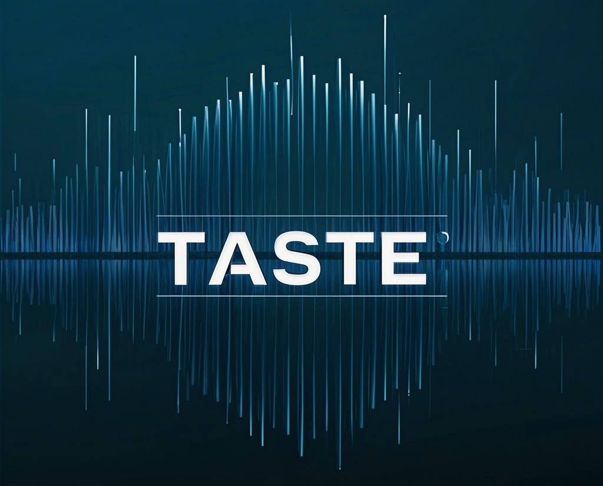
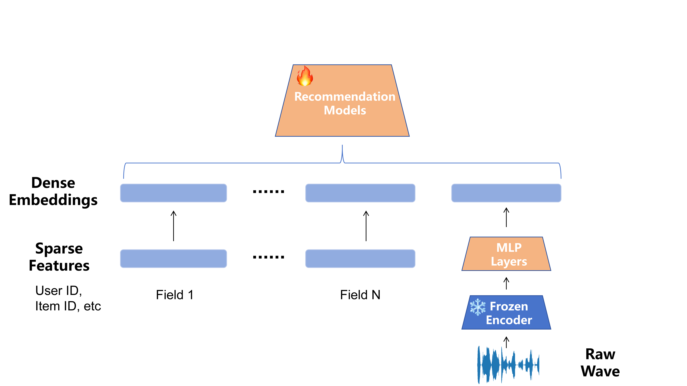

# TASTE
<div align="center">
    
</div>


TASTE is a framework for content-augumented Music Recommendation. It is developed for reproducing and developing recommendation algorithms with content more efficiently.

The proposed subset of lfm-1b and corresponding embedded wav features can be downloaded here: [Google Drive](https://drive.google.com/drive/folders/1H-wrqchl-QMWrO-13mueeO5t-7nL00JU?usp=sharing)

## Overall

<div align="center">
    
    <p>Figure : Overview of the TASTE framework for content-augmented music recommendation.</p>
</div>

This framework includes feature extraction, feature fusion, model training, and testing. 

The traditional features are embedded in the way commonly followed: discrete features are processed using one-hot encoding, then mapped to lower-dimensional continuous vectors; continuous features are discretized according to the defined method by default, and then treated as discrete features (other methods can also be used to handle continuous features).

After the audio and text features are extracted, they pass through trainable MLP layers and are then merged with the previously extracted features to be input into various models, which ultimately output the predicted click-through rate.

Furthermore, we applied the **MuQ-token** method to the multi-layer output of our ""MuQ"" model. By using discrete tokens to represent the audio features, we were able to achieve better results

Our method is highly compatible with various models because it only adds more features without requiring any changes to the model's structure itself.

## Usage

Clone this repository to the local machine, then install the dependencies.
```
pip install -r requirements.txt
```

If you want to manually extract audio features based on your own data and model, you can use the `./notebook/extract_feature.ipynb` in the `./notebooks/` directory. For detailed instructions, please refer to the script files.

### Quick-Start

After downloading the data, place it in `datas\lfm1b-filtered` and then run the following command:

```
python main.py
```

This command runs the framework with the default settings in the simplest way. If adjustments are needed afterward, parameters can be set either through the command line or by using YAML files，for example:

```
python main.py --model_name LR --dataset_name lfm1n-filtered ----config_files config/config1.yaml
```


## Models

Currently, we have implemented the following models on TASTE:

### CTR Task
#### Context-aware Models

| Model | Publish | paper name |
| :--- | :--- | :--- |
| LR | WWW '07 | Predicting clicks: estimating the click-through rate for new ads |
| FM | ICDM'10     | Factorization Machines      
| FFM | RecSys '16 | Field-aware factorization machines for CTR prediction |
| AFM | IJCAI'17    | Attentional Factorization Machines: Learning the Weight of Feature Interactions via Attention Networks |
| Wide & Deep | RecSys'16   | Wide & Deep Learning for Recommender Systems    
| DeepFM | IJCAI'17    | DeepFM: A Factorization-Machine based Neural Network for CTR Prediction |
| NFM | SIGIR'17 | Neural Factorization Machines for Sparse Predictive Analytics  | 
| DCN | ADKDD'17    | Deep & Cross Network for Ad Click Predictions
| xDeepFM | KDD'18      | xDeepFM: Combining Explicit and Implicit Feature Interactions for Recommender Systems | 
| FIGNN | CIKM '19 | Fi-GNN: Modeling Feature Interactions via Graph Neural Networks for CTR Prediction |    
| DCNv2 | WWW '21     | DCN V2: Improved Deep & Cross Network and Practical Lessons for Web-scale Learning to Rank Systems |
| MaskNet | arxiv | Masknet: Introducing feature-wise multiplication to CTR ranking models by instance-guided mask |
| FinalMLP | AAAI'23 | FinalMLP: an enhanced two-stream MLP model for CTR prediction |
| EulerNet | SIGIR'23 | Eulernet: Adaptive feature interaction learning via euler's formula for ctr prediction |
| WuKong | ICML'24 | Wukong: Towards a scaling law for large-scale recommendation |

### Recall Task
#### General Models
| Model | Publish | paper name |
| :--- | :--- | :--- |
| BPR | UAI'09 | BPR: Bayesian personalized ranking from implicit feedback |

#### Multimodel Models

| Model | Publish | paper name |
| :--- | :--- | :--- |
| VBPR | AAAI'16 | VBPR: visual Bayesian Personalized
Ranking from implicit feedback |
| FREEDOM | MM'23 | A tale of two graphs: Freezing and denoising graph structures for multimodal recommendation |
| LGMRec | AAAI'24 | Lgmrec: Local and global graph learning for multimodal recommendation |
<!-- | Model     | Publish     | Paper                                                        |
| :-------- | :---------- | :----------------------------------------------------------- |
| AFM       | IJCAI'17    | Attentional Factorization Machines: Learning the Weight of Feature Interactions via Attention Networks |
| DCN       | ADKDD'17    | Deep & Cross Network for Ad Click Predictions                |
| DCN V2    | WWW '21     | DCN V2: Improved Deep & Cross Network and Practical Lessons for Web-scale Learning to Rank Systems |
| DeepFM    | IJCAI'17    | DeepFM: A Factorization-Machine based Neural Network for CTR Prediction |
| FM        | ICDM'10     | Factorization Machines                                       |
| FFM       | RecSys'16   | Field-aware Factorization Machines for CTR Prediction        |
| WideDeep  | RecSys'16   | Wide & Deep Learning for Recommender Systems                 |
| xDeepFM   | KDD'18      | xDeepFM: Combining Explicit and Implicit Feature Interactions for Recommender Systems | -->

## Audio Featrues

We use pre-trained models to extract high-level music information. The following are the models we used:

| Model     | Publish     | Paper | 
| :-------- | :---------- |   :----------------------------------------------------------- | 
| [CLAP](https://github.com/microsoft/clap)      | ICASSP'22    | Natural Language Supervision For General-Purpose Audio Representations |
| [MuQ](https://github.com/tencent-ailab/MuQ)       | arxiv    | MuQ: Self-Supervised Music Representation Learning with Mel Residual Vector Quantization  |

The MuQ model has two versions: **MuQ** and **MuQ-mulan**.

* **MuQ** provides the model's raw output, which includes both the number of layers and the time dimension. 
* **MuQ-mulan** is a fine-tuned version of MuQ, trained specifically on a music-text dataset, and its output has a shape of (512,).

## Results

## Acknowledgement
<!-- We sincerely appreciate the help provided by [Recbole](https://github.com/RUCAIBox/RecBole). -->

We gratefully acknowledge the inspiration and guidance we received from frameworks [Recbole](https://github.com/RUCAIBox/RecBole), [MMRec](https://github.com/enoche/MMRec), and [FuxiCTR](https://github.com/reczoo/FuxiCTR).

## Future
We are working on adding more existing models, especially multimodal models.
